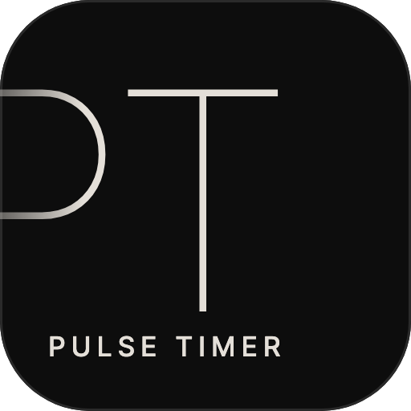

<p align="center"></p>
<h1 align="center">Pulse Timer</h1>
<p align="center"><a href="https://pulsetimer.elijahfrost.com">pulsetimer.elijahfrost.com</a></p>

Pulse Timer is a browser timer with three tabs. The interval timer splits a session into repeating rings, and a variability slider randomizes how long each ring lasts, so the cue arrives at an unpredictable moment, while a pattern editor sets fixed phase lengths instead. The other two tabs are a standard countdown timer and a stopwatch.

The app keeps the screen awake while a timer runs, remembers settings in local storage, and supports Space, Enter, and Escape as keyboard shortcuts. The app plays `public/sounds/chime.m4a` at each ring.

## Run it locally

```bash
npm install
npm run dev
```

The app runs at http://localhost:3000. Built with Next.js 14, React, TypeScript, and Tailwind CSS, and deployed on Vercel.
